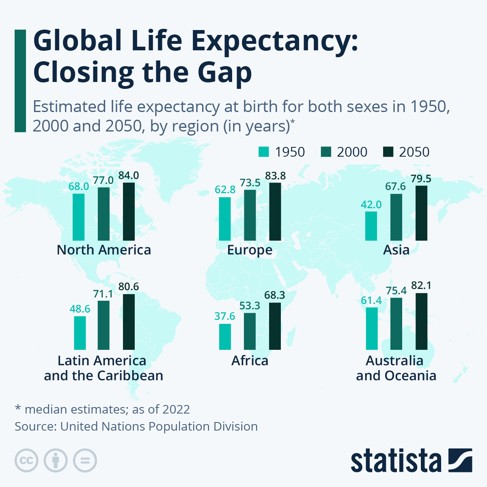
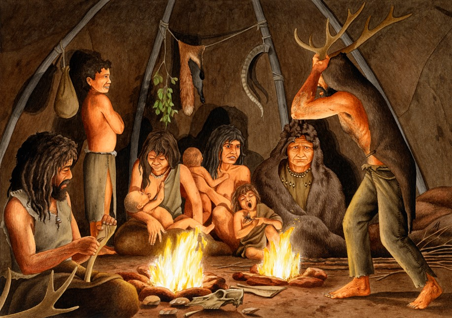

```{r setup, echo=FALSE, include=FALSE}

library(tidyverse)
library(ggplot2)
library(dplyr)
library(tidyr)
library(knitr)      
library(leaflet)
library(hexbin)
library(readxl)
library(viridis)
library(knitr)
library(reshape2)
library(quantreg)
library(lubridate)
library(dplyr)
library(lme4)
library(MuMIn)
library(patchwork)
library(olsrr)

```



```{r data readin, echo=FALSE, include=FALSE}

life <- read.csv("who_life_expectancy.csv") %>% 
  filter(Year == "2015") %>% 
  select("Country", "Year", "Status", "Life.expectancy", "BMI", "GDP", "Resources","Education")

life <- na.omit(life)

```

# WHO Data on Life Expectancy by Country

```{r table, echo=FALSE, include=TRUE}

top_10_rows <- head(life, 10)

kable(top_10_rows)

```

**Life expectancy differs depending on the status of the country. Developing countries have less access to improved medical care, immunizations, clean water, and health education.**

# Life Expectancy by Country Status

```{r plot1, echo=FALSE, message=FALSE, warning=FALSE, include=TRUE}

ggplot(life, aes(x=Status, y=Life.expectancy, fill=Status)) +
  geom_bar(stat = "summary", width = .3) +
  geom_errorbar(stat = "summary", width = .2)

```

# Checking the Data

**Several variables can influence the life expectancy of a population.**

```{r colinearity, echo=FALSE, message=FALSE, warning=FALSE, include=TRUE}

pairs(life[,4:8], lower.panel = NULL)

```

**Checking the correlation matrix.**

``` {r corr, echo=FALSE, message=FALSE, warning=FALSE, include=TRUE}

correlation.matrix <- cor(life[,4:8])
round(correlation.matrix, 2)

```

# Modeling the Data

```{r model, echo=FALSE, message=FALSE, warning=FALSE, include=FALSE}

lifemodel1 <- lm(Life.expectancy ~ BMI + GDP + Resources + Education, data = life, na.action = "na.fail")

olsrr::ols_plot_added_variable(lifemodel1)

```

**Checking models.**

``` {r dredge, echo=FALSE, include=TRUE}

results <- MuMIn::dredge(lifemodel1)
results

```

# Plotting the Best Models

**Plotting the two best models.**

``` {r final, echo=FALSE, message=FALSE, warning=FALSE, include=TRUE}

ggplot(life, aes(Resources, Life.expectancy, group=Year)) +
  geom_point() +
  geom_smooth(method = "lm") +
  labs(x="Resources", y="Life Expectancy")

ggplot(life, aes(BMI, Life.expectancy, group=Year, color=Resources)) +
  geom_point() +
  geom_smooth(method = "lm") +
  labs(x="BMI", y="Life Expectancy")

```

**Fun Fact!**

